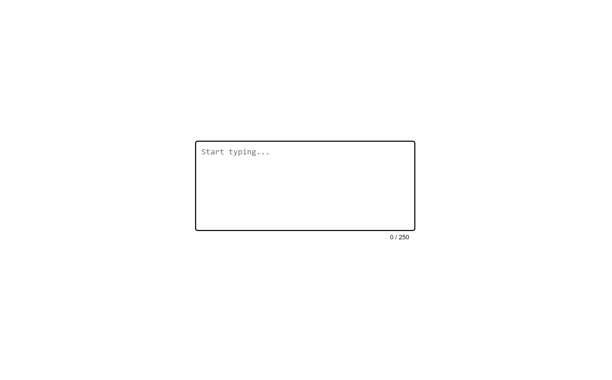

# Restricted Textarea

A simple web project that creates a restricted textarea input field with a character limit. It visually updates the user on how many characters they have typed and highlights when the limit has been reached.

Visit the project page here: [Restricted Textarea on roadmap.sh](https://roadmap.sh/projects/restricted-textarea).

## Table of Contents
- [Overview](#overview)
- [Features](#features)
- [Project-Structure](#project-structure)
- [Author](#author)
- [Acknowledgments](#acknowledgments)
- [License](#license)

## Overview
The **Restricted Textarea** is a minimalistic project designed to restrict the number of characters a user can input in a `textarea` field. It provides real-time feedback on the number of characters entered and changes the styling when the character limit is reached.

This project can be useful for forms where user input needs to be constrained to a specific length, such as tweet-like input boxes, feedback forms, etc.

Visit the project page on [roadmap.sh](https://roadmap.sh/projects/restricted-textarea).

## Features
- Character limit enforced on a textarea (default: 250 characters).
- Real-time character counter.
- Visual feedback when the character limit is reached.
- Customizable with basic HTML, CSS, and JavaScript.

## Project Structure

```
restricted-textarea/
│
├── index.html       # Main HTML file
├── styles.css       # CSS for styling the textarea and counter
├── script.js        # JavaScript to handle character counting and limit enforcement
├── images/
│   ├── Screenshot.png   # Screenshot of the restricted textarea demo
│   └── logo.png         # Project logo (optional)
```

- **index.html**: The main HTML file containing the structure of the textarea and the character counter.
- **styles.css**: Contains styles for the layout and visual feedback when the character limit is reached.
- **script.js**: The JavaScript file that manages the character count and updates the UI accordingly.
- **images/**: A folder that holds the screenshot of the project and the logo.

  - **screenshot.png**: A screenshot of the working textarea with character restriction.
  - **logo.png**: The project's logo (optional).

## Visual 

Below is the Screenshot



## Author

- **Yashi Singh** - Developer

## Acknowledgments

- Special thanks to [roadmap.sh](https://roadmap.sh/) for including this project in their list.
- Thanks to the open-source community for inspiration and guidance.

## License

This project is licensed under the MIT License - see the [LICENSE](LICENSE) file for details.
